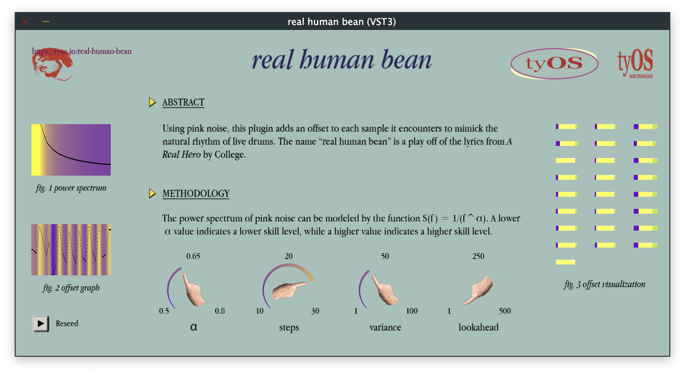

# real human bean

*real human bean* is an audio plugin that applies humanized offsets to a stream of samples, making the samples sound as
if a person played them. It is ideal for channels that contain one drum part, such as a hi hat channel, snare channel,
etc.

The math behind why these offsets mimic human drum playing is described in [this
paper](https://researchportal.helsinki.fi/en/persons/saara-loviisa-malila) by Saara Malila.

## Installation

*If you want an AU or the standalone version, just ask me. If you want support for Windows you can buy me a
certificate.*

1. Go to releases and download the latest VST3.
2. Move the VST3 to `/Library/Audio/Plug-Ins/VST3`.
3. Restart your DAW and scan for new plugins.
4. That's it!

## Contributions

If you have any bugs, issues, or ideas, feel free to report them on here. This is my first plugin, so I am open to
hearing about what I can do better code and/or design wise.

## License

MIT? Idk lmao.

